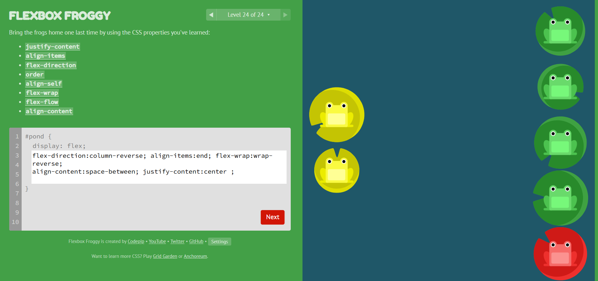
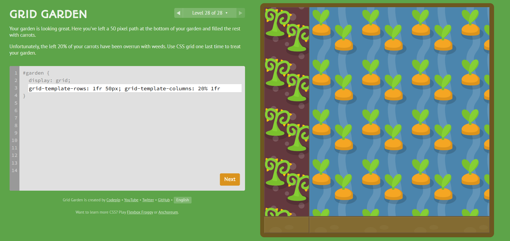

# 🎨 Modern CSS Layouts

## 🚀 About  
Practice project based on **Flexbox Froggy** and **Grid Garden** concepts using modern CSS layouts.

---

## 🖼️ Flexbox Practice  

---

## 🖼️ Grid Practice  

---

## 🛠️ Tech Stack  
- HTML5  
- CSS3  
- Flexbox  
- CSS Grid  

---

## 📚 What I Learned  
- Flexbox alignment & positioning  
- CSS Grid layouts  
- Responsive layout concepts  
- Modern CSS structuring techniques  

---

⭐️ Practicing modern CSS one step at a time 🚀
